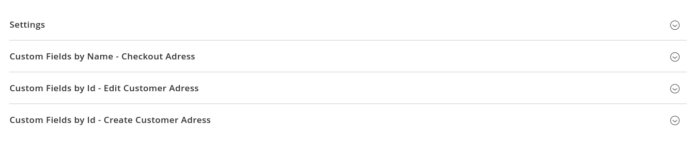
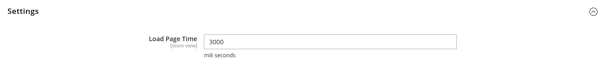
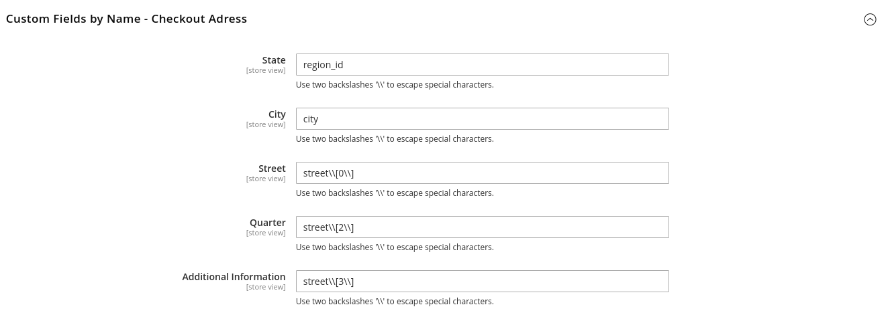
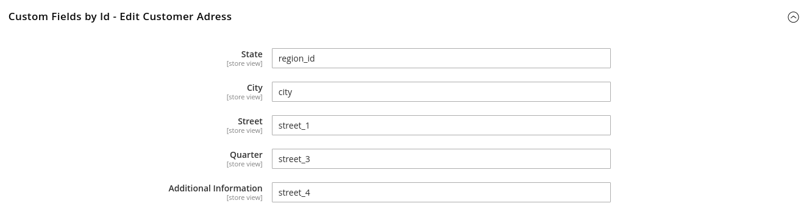
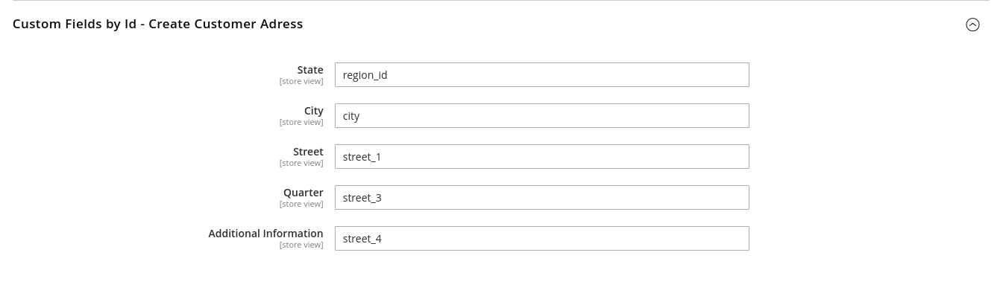

# Tezus_AutoComplete

Módulo para auto completar as informações de endereço do cliente.

# Configurações

No painel do Admin, acesse a opção de *Lojas > Configuração > Vendas > Geral > Geral* e preencha o **País Padrão** colocando **Brasil**.
Ainda, o módulo permite configurações de campos customizados no Checkout, Criação de clientes e edição de endereço, para isso acesse *Lojas > Configuração > Tezus > Auto Complete*.

Nessa tela existe 4 sessões, **Configurações**, **Campos Customizados pelo Nome - Endereço no Checkout**, **Campos Customizados pelo ID - Edição de endereço do Cliente** e **Campos Customizados pelo ID - Criar endereço do Cliente**.

## Configurações

Nesta sessão você pode configurar o tempo de carregamento da página, onde será exibida a animação de carregamento.

## Campos Customizados pelo Nome - Endereço no Checkout

Nesta sessão você pode configurar os campos que serão utilizados para preencher as informações de endereço do clientes. Deve ser utilizado o nome do campo, e não o ID.
*OBS: Para utilizar caracteres especiais, utilize a barra invertida.*

## Campos Customizados pelo ID - Edição de endereço do Cliente

Nesta sessão você pode configurar os campos que serão utilizados para preencher as informações de endereço na página de edição de endereço do usuário. 
*OBS: Neste grupo você deve utilizar o ID do campo a ser preenchido.*

## Campos Customizados pelo ID - Criar endereço do Cliente

Nesta sessão você pode configurar os campos que serão utilizados para preencher as informações de endereço na página de criação de endereço do usuário. 
*OBS: Neste grupo você deve utilizar o ID do campo a ser preenchido.*

